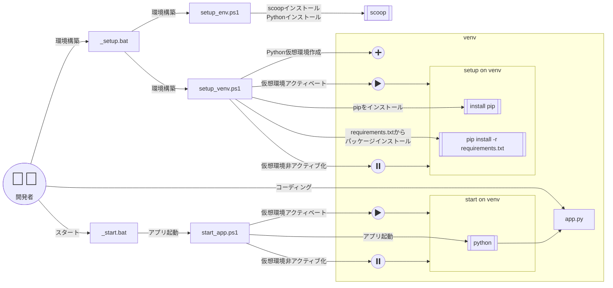
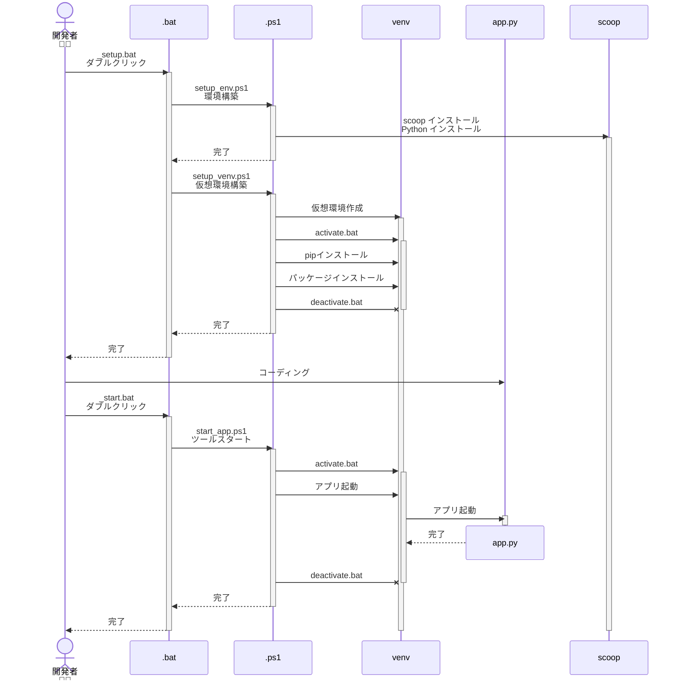

# Python Flask Jinja2 Web Application - 統合開発環境

## 概要

このプロジェクトは、Flask + Jinja2を使用したWeb アプリケーション開発環境です。
最新の開発環境セットアップスクリプトと、包括的なWeb機能を統合しています。

### 主な機能

- **Flask Webアプリケーション**
  - ユーザー認証とロールベースアクセス制御
  - セッション管理（自動ロック・アンロック機能）
  - パスワードポリシーと有効期限管理
  - セキュリティログ機能
  - 多言語対応（日本語・英語）

- **開発環境**
  - Scoopによる自動環境構築
  - Python 3.12仮想環境
  - 包括的なテスト環境（ユニットテスト、Flask Client、E2Eテスト）

---

## 使い方（とても簡単😁）

### 初回セットアップ

1. このフォルダを任意の場所に展開します。
2. `_setup.bat` をダブルクリックします。

**処理概要:**
- [Scoop](https://scoop.sh/)のインストール（未インストールの場合）
- Gitのインストール（Scoop使用）
- GitのSSLバックエンド設定
- Pythonのインストール（Python 3.12、Scoop使用）
- 仮想環境の作成（venv）
- 必要なPythonパッケージのインストール（`requirements.txt`を使用）
- 開発用パッケージのインストール（テスト・リント・フォーマッタなど）

### アプリケーションの起動

3. `_start_app.bat` をダブルクリックします。

**処理概要:**
- 仮想環境のアクティベート
- 必要なパッケージの更新確認
- Flaskアプリケーションの起動
- ブラウザで http://localhost:5000 にアクセス

### テストの実行

4. `_test_app.bat` をダブルクリックします。

**処理概要:**
- ユニットテストの実行
- Flask Clientテストの実行
- E2Eテスト（Playwright）の実行
- カバレッジレポートの生成

### トラブルシューティング

うまく動作しないときは：
1. `_clean.bat` を実行
2. 再度 `_setup.bat` からやり直してください

---

## 動作環境

- Windows 10 以降
- インターネット接続（初回セットアップ時に必要）
- ブラウザ（Chrome、Edge、Firefox等）

---

## 技術スタック

- **Python**: 3.12
- **Webフレームワーク**: Flask
- **テンプレートエンジン**: Jinja2
- **認証**: Flask-Security-Too
- **セッション管理**: Flask-Session
- **データベース**: SQLAlchemy (SQLite)
- **国際化**: Flask-Babel
- **グラフ描画**: Plotly
- **テスト**: pytest, pytest-cov, pytest-playwright
- **コード品質**: black, isort, pylint

---

## 初期ユーザー

### 管理者
- **ユーザー名**: `admin`
- **パスワード**: `Admin999!`

### 一般ユーザー
- **ユーザー名**: `user`
- **パスワード**: `User999!`

※ 初回ログイン後、パスワード変更が必須です

---

## 概要図

### スクリプト関連図

:::mermaid

:::

### スクリプト動作シーケンス図

:::mermaid

:::

---
